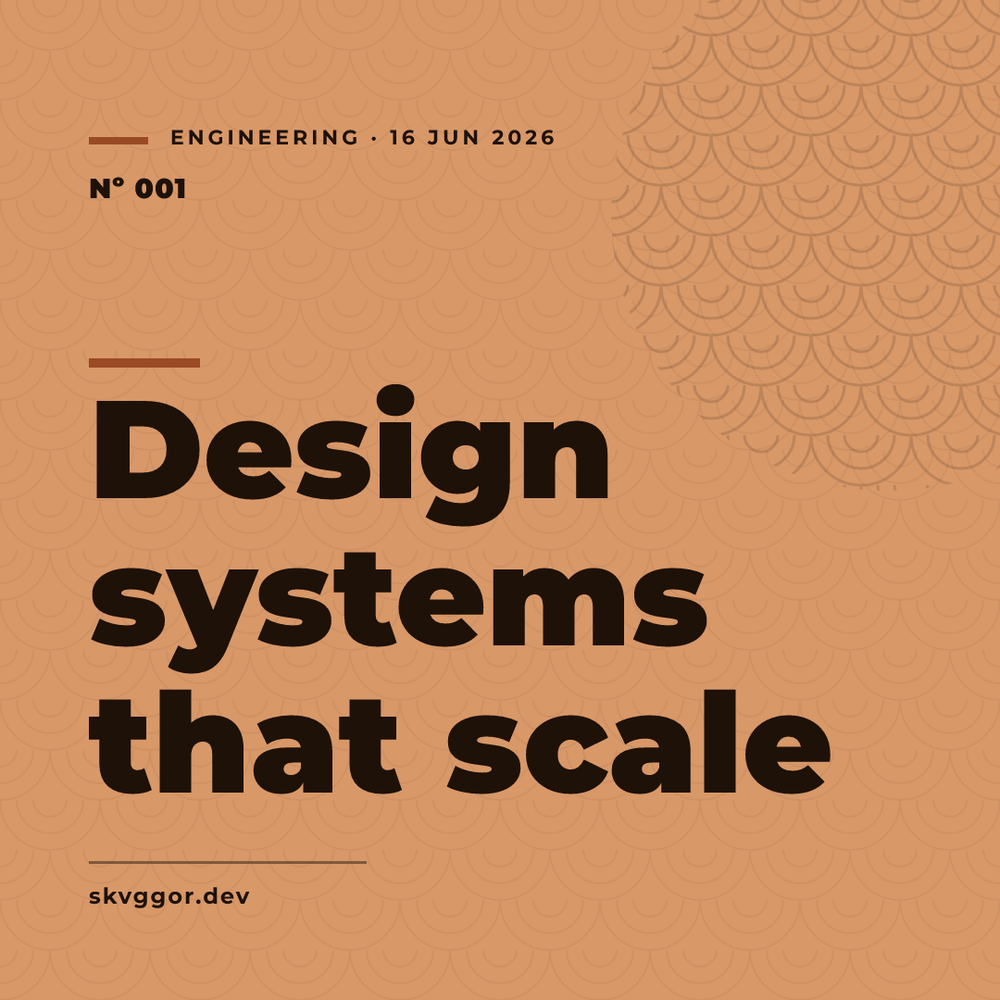
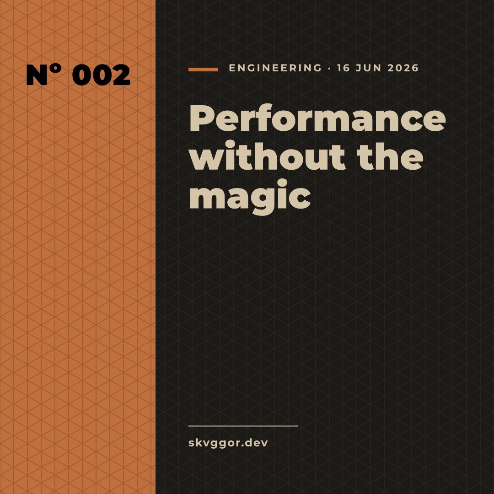
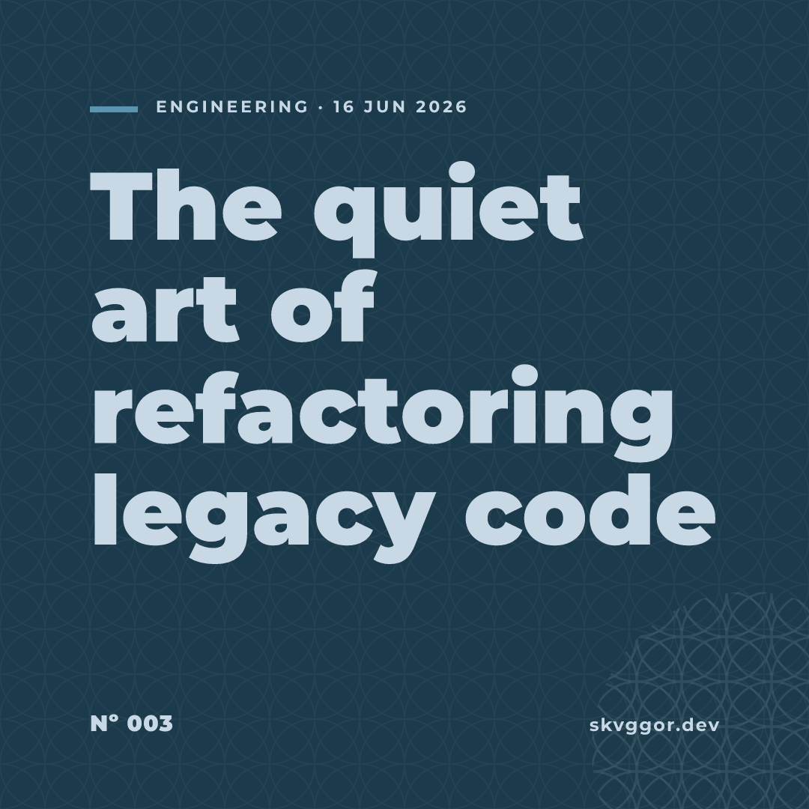

<p align="center">
  
</p>

<h1 align="center">article-cover-art-generator</h1>

<p align="center">
  A native desktop app that generates <strong>1:1 article cover art</strong> in an
  <strong>Omakase / Japanese-constructivist</strong> style — live preview, six themes,
  five traditional patterns, three layouts, exported as a crisp <strong>2160² PNG</strong>
  (plus the source SVG).
</p>

<p align="center">
  
  
  
</p>

## The idea

Built around **Omakase** (お任せ — "I leave it to you", the sushi chef's choice) and the
geometry of traditional Japanese patterns (**wagara**, 和柄), tempered with bold,
structural, constructivist typography. The result is calm but assertive: a huge
**Montserrat Black** title, a lot of **Ma** (negative space), and a quiet wave "seal".

The Japanese identity comes **only from geometry and color** — there are deliberately
**no Japanese glyphs in the artwork**. It shares its design language (themes, wagara,
the sumi-ê palette) with [skvggor.dev](https://skvggor.dev) and
[`waka-readme`](https://github.com/skvggor/waka-readme).

## Features

- **6 sumi-ê themes** — `terracotta` 赤土 · `sumi` 墨 · `matcha` 抹茶 · `washi` 和紙 · `ai` 藍 · `sakura` 桜
- **5 wagara patterns** — `seigaiha` (waves) · `shippo` (interlocking circles) · `kikko`
  (tortoiseshell) · `yabane` (arrow feathers) · `asanoha` (hemp leaf)
- **3 layouts** — `editorial` (asymmetric), `bloco` (constructivist color block), `ma` (negative space)
- **Live preview** — every control updates the square preview instantly
- **Film grain** — optional fractal-noise overlay, shown in the preview and the export
- **Omakase button** — randomizes the visual style and lets the house plate it for you
- **WCAG AAA** — all readable text is forced to ≥ 7:1 contrast against its background
- **Montserrat** Black / Bold / Regular, embedded in the binary (no system fonts needed)
- **Export** — 2160×2160 PNG and the resolution-independent source SVG
- **Native** — Rust + [slint](https://slint.dev) + [resvg](https://github.com/linebender/resvg),
  running directly on Wayland (no web view, no Node)

Only the **title** is required; category, date, number and brand are optional, keeping the
cover generic enough for any platform (blog, dev.to, LinkedIn, X, OG image, thumbnail…).

## Build & run

Requires a recent stable Rust toolchain.

```sh
cargo run --release
```

Covers are saved to `~/Pictures/article-covers/` (named from the title). Set
`ACAG_OUTPUT_DIR` to write them somewhere else.

### Install on Omarchy / Hyprland

```sh
cargo build --release
install -Dm755 target/release/acag ~/.local/bin/acag
install -Dm644 assets/icons/icon-512.png \
  ~/.local/share/icons/hicolor/512x512/apps/article-cover-art-generator.png
install -Dm644 assets/article-cover-art-generator.desktop \
  ~/.local/share/applications/article-cover-art-generator.desktop
```

It will then show up in the app launcher (walker/rofi). Run it from a terminal with `acag`.

## Usage

1. Type a **title** (the only required field).
2. Fill in optional **category / date / number / brand**.
3. Pick a **theme**, **pattern** and **layout**; toggle **film grain**.
4. Hit **Omakase** to shuffle the style, or set it by hand.
5. **Export PNG** (2160²) or **Export SVG**.

## How it works

A single pure function, `render_cover_svg(&CoverConfig) -> String`, is the source of truth.
The live preview and both exports rasterize **the same SVG** with resvg/tiny-skia, so the
preview is exactly the file you get. Titles are auto-wrapped and auto-sized using the real
Montserrat glyph metrics (`ttf-parser`).

```
src/
  design/   themes · wagara patterns · WCAG contrast
  cover/    config · typesetting · render · layouts (editorial/bloco/ma)
  raster.rs SVG → Pixmap/PNG (resvg + embedded Montserrat)
  export.rs save SVG / 2160² PNG
  main.rs   slint GUI wiring
ui/app.slint  the editor + live preview
```

## Development

```sh
cargo test                 # unit tests
cargo run --example gallery  # regenerate docs/samples
cargo run --example icon     # regenerate the app icon
```

## Credits

- **Montserrat** by Julieta Ulanovsky et al. — [SIL Open Font License](https://github.com/JulietaUla/Montserrat).
- **resvg / tiny-skia** and **slint** for native rendering and UI.
- Design language shared with [skvggor.dev](https://skvggor.dev) and `waka-readme`.

## License

[MIT](LICENSE).
